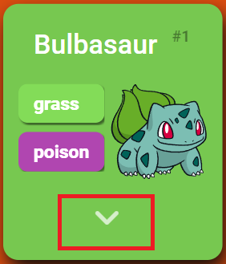
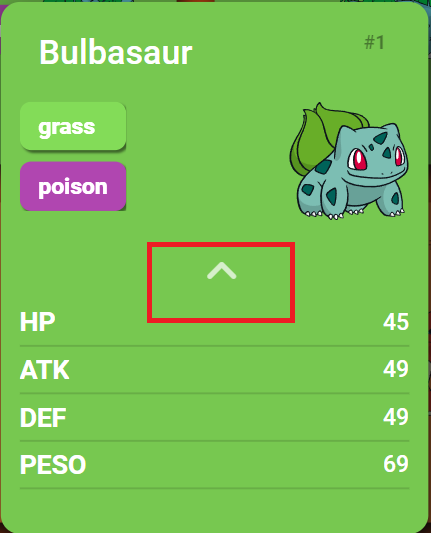
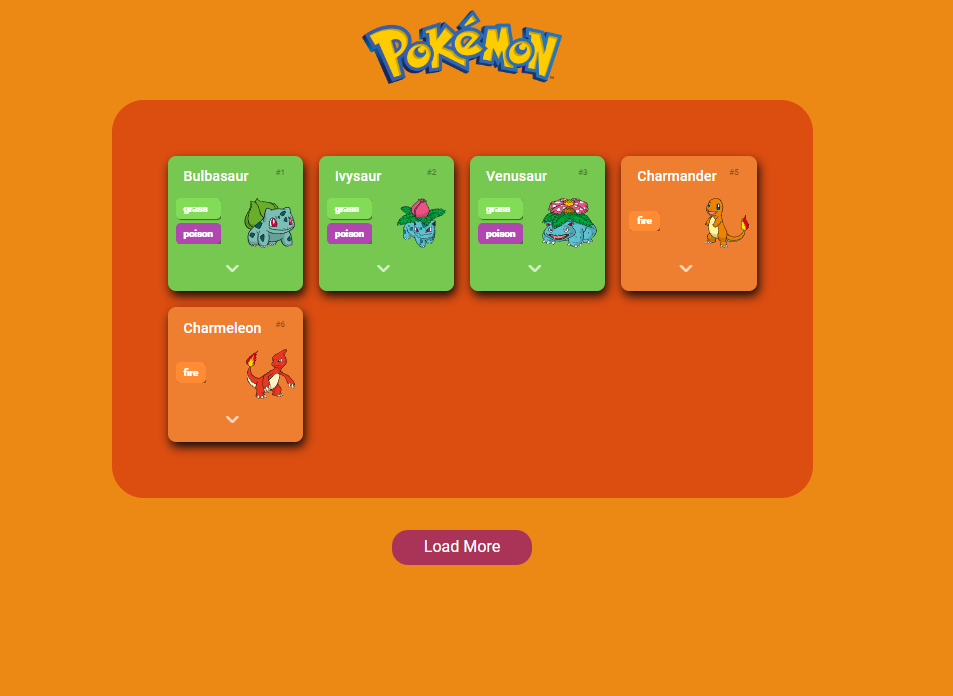
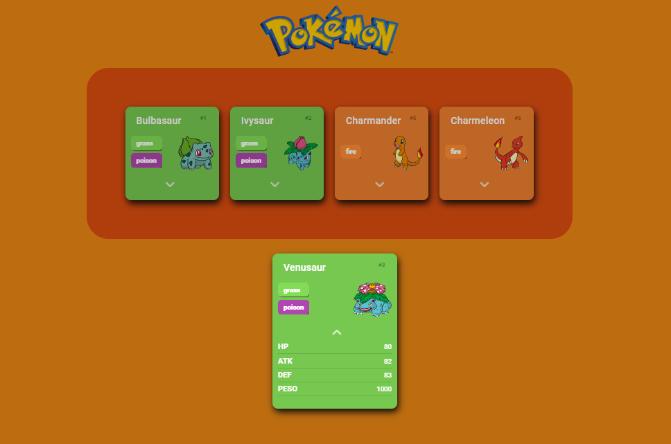
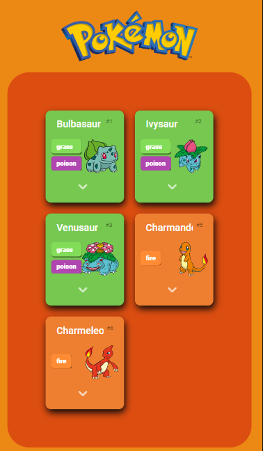
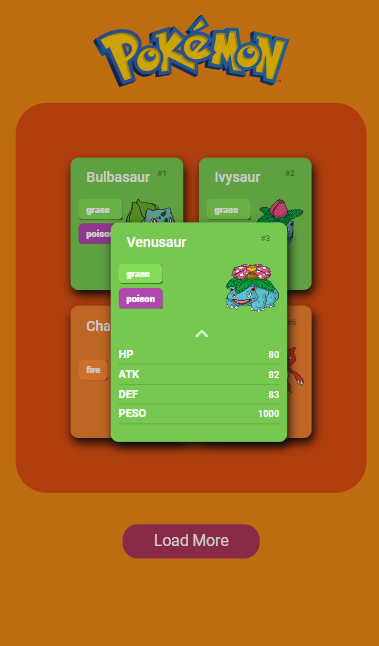

# POKEDEX

#### Desafio feito no  curso [DIO](https://www.dio.me/) com o professor Renan Johannsen, onde desenvolveriamos uma pokedex utilizando a [PokeApi](https://pokeapi.co/). O desafio final era incrementar mais dados na pokedex, o qual eu escolhi fazer um menu que se extende e mostra mais informações sobre o pokemon do card selecionado.

## O que faz?

### - Mostra ao usuário os pokemons dentro de um card onde contém as informações:

- Nome
- Tipo

### - O usuário pode extender o menu usando a seta para mais informações sobre o pokemon no card desejado ou retornar a tela principal.

#### - O menu extendido possui informações sobre:

- HP do Pokemon.
- Ataque do Pokemon.
- Defesa do Pokemon
- Peso do Pokemon.

## Design:

## Versão desktop:

## Versão mobile:

### Resultado:

[Clique aqui 😃](https://daniielluiiz.github.io/estudo-api-pokemon/)

### Tecnologias usadas:

- HTML5
- JavaScript
- CSS

### O que aprendi/aprimorei?

- Entendimento do protocolo HTTP.
- Integração com API.

 
